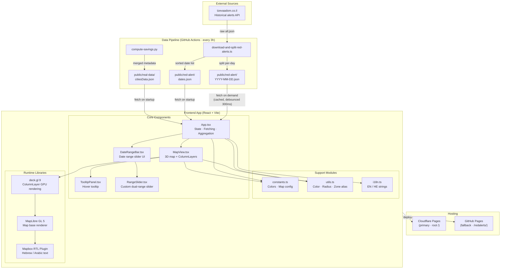
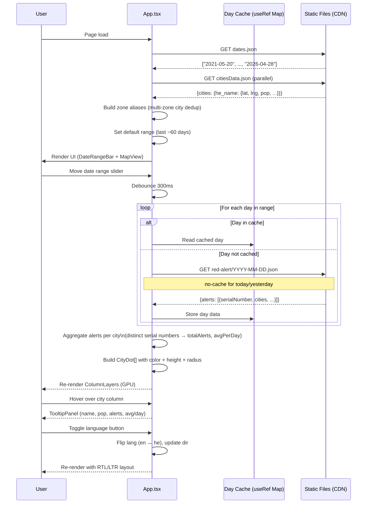
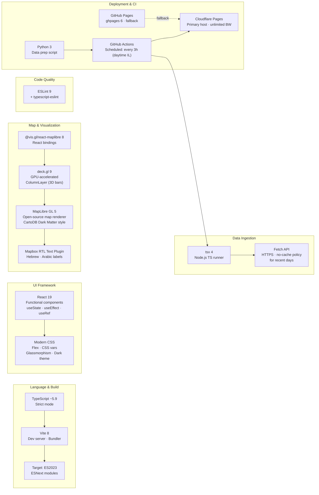

# Red Alerts — Israel Rocket Alert Visualizer

An interactive map visualizing rocket alert (צבע אדום) data across Israel, from 2021 to the present.

**Live:**
[redalerts.pages.dev](https://redalerts.pages.dev)

**Github:**
[peterbak6.github.io/redalerts](https://peterbak6.github.io/redalerts)

**Website:**
[https://visualanalytics.co.il/redalerts](https://visualanalytics.co.il/redalerts)

## Features

- Browse every alert day since 2021 with a date slider and playback mode
- City circles scaled by population, colored by alert count
- Tooltip showing alert count, population, and exact alert times per city
- Hebrew / English toggle
- Alert data updated automatically every 3 hours during Israeli daytime

## Tech Stack

- [React](https://react.dev) + [TypeScript](https://www.typescriptlang.org) + [Vite](https://vitejs.dev)
- [deck.gl](https://deck.gl) for map layers
- [MapLibre GL](https://maplibre.org) for the base map
- GitHub Actions for scheduled data fetching and deployment
- Cloudflare Pages for hosting (unlimited bandwidth)

## Development

```bash
npm install
npm run dev
```

## Data

Alert data is sourced from [tzevaadom.co.il](https://www.tzevaadom.co.il) and split into per-day JSON files under `public/red-alert/`. City metadata and population data are under `public/real-data/`.

## Architecture

### System Architecture



### Data Flow & User Interactions



### Technology Stack



## License

[MIT](LICENSE)
